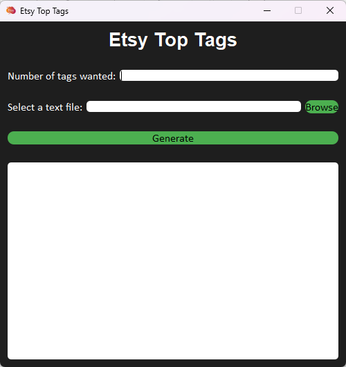

# Etsy Top Tags Tool


This is a simple Python program that generates the top tags based on repetition and value from a text file. The program reads in a text file containing word combinations and their corresponding values, calculates the count and value of each word in the combinations, assigns a score to each combination based on the count and value of its words, and displays the top phrases in the console or a GUI.

Getting Started
-----------

Prerequisites

To run this program, you will need to have Python 3 installed on your computer. You can download Python 3 from the official website: https://www.python.org/downloads/

Installing
------------

Clone this repository to your local machine using 

```
git clone https://github.com/mrbadr1/Etsy_Top_Tags.git
```

Navigate to the project directory using 
```
cd Etsy_Top_Tags
```
Install the required packages using 
```
pip install -r requirements.txt
```

Usage

To run the program, navigate to the project directory and run the following command:

```
python Etsy_Top_Tags.py
```

This will open a GUI window that allows you to select the text file and enter the number of top phrases you want to generate.
Contributing
If you would like to contribute to this project, please fork the repository and submit a pull request. You can also submit bug reports or feature requests by opening an issue.


